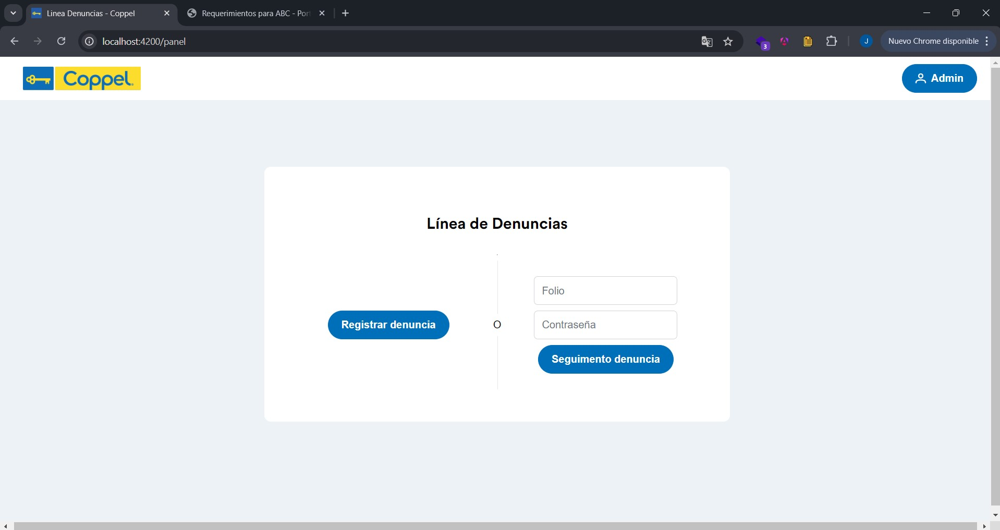

# Aplicación web - Portal Denuncias
## Frontend
### Angular - PrimeNG - Coltrane
Interfaz de usuario diseñada con los elementos UI de PrimeNG y su integración con las reglas de diseño Coltrane obtenidas en coppel-design.com

## Backend
Api Rest codificada en Javascript haciendo uso del entorno de ejecución Node.js, la librería Express y el ORM Sequelize para la manipulación y el acceso de datos.

## Base de datos
Instancia de base de datos PostgreSQL creada en un servicio Cloud SQL de Google Cloud Platform para su posterior consumo y manipulación.